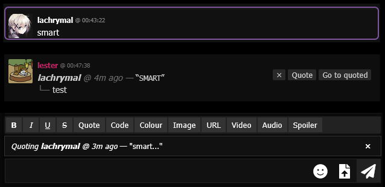
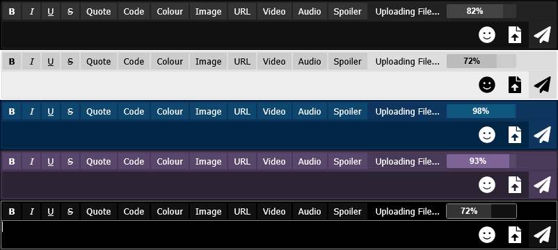

# Flashii Chat Userscripts
_A collection of scripts to extend chat functionality. Please have Greasemonkey/Tampermonkey installed._

---

## Better Quotes & Delete Button

### Delete Functionality
- **Shift+Click** the timestamp of your own message to delete it; or  
- **Hover** your own message to reveal an `x` button for deletion.  
- If not needed, the delete functionality can be disabled by setting the `enableDelete` constant variable to `false`.

### Quote Functionality
#### Partial Quoting
- Highlight some text from a chat message
- Click quote button
- Selected text will be wrapped with `[quote]` BBcode and inserted into input field

#### Wholesale Quoting
- Select a message to quote (click timestamp or quote button)
- Quote preview will show the first 100 chars of the quoted message, will not clutter the input field
- Your input will be appended to the quoted message upon sending
- 'Go to quoted' or clicking quoted message timestamp will jump to and highlight the original message

#### Additional Notes
- Quoted messages use relative time (auto-updating as you type/send).  
- CSS variables from the chat are reused, so styling matches existing chat themes.  
- Choose between buttons or clickable timestamps by toggling the `showButtons` constant variable.  

---

## File Upload Progress Bar
- Adds a theme-fitting progress bar for file uploads, displayed on the formatting bar.  
- Multiple uploads are shown as a combined progress for better visibility.

