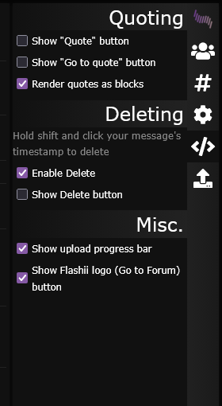
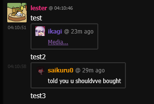

# Flashii Chat Userscripts
_Flashii Chat userscript by lester. Please have Greasemonkey or Tampermonkey installed._

## Note
_The following userscripts are deprecated. Please use the Ultreme Script instead._
_1. better-quotes-n-delete.user.js_
_2. file-upload-progress-bar.user.js_

## Ultreme Script
Ultreme Script is the all-in-one userscript for Flashii Chat.

## Features

### Quoting
- Quote button for quick full-message quoting
- Partial quoting by selecting message text and using the chat quote button
- Quote preview above the input before sending
- Quote blocks with author, avatar, and relative timestamp
- Jump to the original quoted message from quote links and quote blocks
- Ctrl+Up / Ctrl+Down keyboard navigation for selecting messages to quote

### Message Tools
- Delete your own messages with Shift+Click on the timestamp
- Optional delete button on your own messages

### Uploads
- Upload progress bar with inside/outside display options
- Combined progress tracking for multiple simultaneous uploads

### Navigation
- Flashii logo button that opens the forum

### Media
- Media viewer for quoted image, video, and audio links

### Script Options
- Sidebar settings page for toggling features without editing the script
- Update checker with manual check and in-chat update prompt

## Download

